# RAPORT — Praca domowa Git zaawansowany

---

## Zadanie 1 — Pierwszy konflikt merge (CLI + IntelliJ + GitHub)

**1. Jaki był hash merge commitu w wariancie A (CLI)? A w wariancie B (IntelliJ)? Czy są takie same?**

Nie, hashe nie są takie same, ponieważ każdy z nich zawiera timestamp, autora itp.

**2. Jaką domyślną wiadomość commit wygenerował Git w wariancie A (CLI)? A IntelliJ w wariancie B?**

`feature/add-salad` (IntelliJ & CLI)

**3. Kiedy najwygodniej rozwiązywać konflikt w UI GitHuba (wariant C), a kiedy lepiej zrobić to lokalnie?**

Kiedy patrzymy na nie nasz kod i nie mamy dostępu do niego lokalnie. Możemy zrobić merge np. z feature od kolegi i wtedy rozwiązywać konflikt na GitHubie.

**4. Wymień 2 powody, dla których IntelliJ 3-panel jest wygodniejszy niż edycja markerów ręcznie.**

Jest czytelniejszy i bardziej zautomatyzowany. W IntelliJ 3-panel możemy nacisnąć na strzałki i wybrać co gdzie dodamy, a ręcznie trzeba usuwać markery.

**5. Załącz screenshot 3-panelowego narzędzia IntelliJ podczas rozwiązywania konfliktu.**

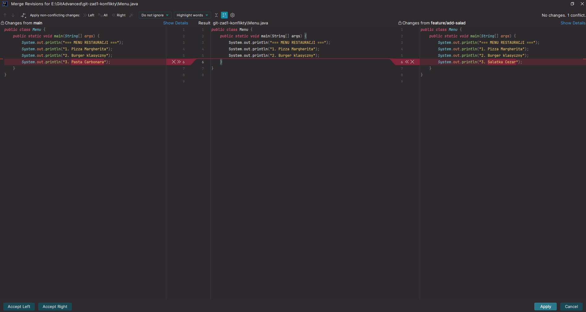

---

## Zadanie 2 — Konflikt na rebase zamiast merge

**1. Jak wygląda `git log --graph --oneline --all` po rebase? Załącz screenshot.**

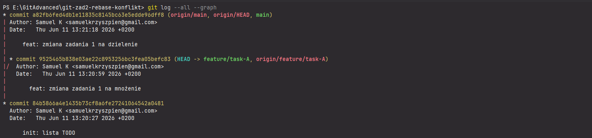

**2. Jaka jest różnica w historii między rozwiązaniem przez merge (zad. 1) a rebase (zad. 2)?**

W merge widać jak dwa branche przechodzą w jeden, a w rebase się urywa i gwiazdka zostaje po prawej stronie — nie ma linii w której się razem schodzą.

**3. Dlaczego po rebase trzeba użyć `git push --force-with-lease`? Co by się stało, gdybyś użył zwykłego `git push`?**

**4. Czym różni się `--force-with-lease` od `--force`? Kiedy używać którego?**

*Odpowiedź na oba naraz:*

`git push --force` nadpisuje, czyli jeżeli ktoś pracuje na tej samej branch co my i robi commit i potem push, a ja nie sprawdziłem tego i robię push force — jego praca znika. A w `force-with-lease` jest sprawdzane czy origin wygląda tak samo. Jeżeli nie, to Git odmawia i wywala ostrzeżenie, a jeżeli tak — to przechodzi.

**5. Co robi `git rebase --abort`? Kiedy chcesz tego użyć?**

`rebase --abort` używamy gdy chcemy cofnąć się od rebase. Czyli mamy jakiś konflikt i chcemy anulować rebase.

---

## Zadanie 3 — Git Stash w sytuacji "pilny hotfix"

**1. Jaka jest różnica między `git stash pop` a `git stash apply`? Kiedy chcesz użyć którego?**

`pop` w Git działa tak samo jak w queue — LIFO, czyli ostatni in, ostatni out. Zabiera pierwszy z góry stash, gdzie `stash apply` możemy wybrać który chcemy.

**2. Co się dzieje gdy masz 2 stashe i robisz `git stash pop`? Który zostanie wyciągnięty?**

Pierwszy z góry, czyli ostatni dodany.

**3. Dlaczego `git stash` domyślnie nie chowa untracked files? Kiedy to jest problem?**

To może być problem gdy zapomnimy że coś zestashowaliśmy i potem kilka commitów później sobie o tym przypomnimy — wtedy trzeba usuwać te pliki ze wszystkich branchy itp.

**4. Czy stash idzie na remote po `git push`? Sprawdź na GitHubie — czy widzisz tam stashe?**

Tak, stash pliki idą na remote.

**5. Załącz screenshot `git stash list` z momentu, gdy miałeś 2 stashe.**

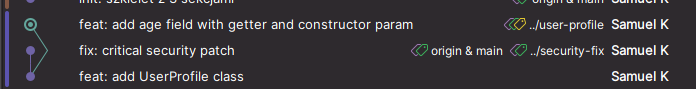

---

## Zadanie 4 — Cherry-pick: przeniesienie commita między gałęziami

**1. Jaki był hash oryginalnego commita na `feature/A`? Jaki na `main` po cherry-pick? Załącz oba `git log --oneline`.**

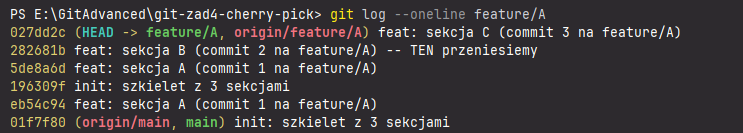

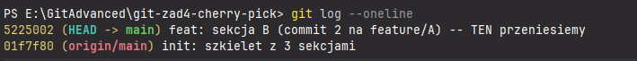

**2. Dlaczego hash jest różny, jeśli treść (diff) jest identyczna? (Wskazówka: parent commit, timestamp.)**

Hash jest różny, ponieważ parent commit jest inny — na main parent to ostatni commit main, a na feature/B parent to inny commit. Każdy hash zawiera w sobie hash rodzica. Plus cherry-picking tworzy nowy commit z aktualnym czasem.

**3. Co zawiera `app.txt` na main po cherry-pick (która sekcja jest wypełniona, a które mają nadal `[TODO ...]`)? Czego tam nie ma?**

Po cherry-pick sekcja B jest wypełniona, a sekcje A i C nie są.

**4. Co się dzieje, gdy cherry-pick wywoła konflikt? Jak go rozwiązać (analogia do merge/rebase)?**

Gdy cherry-picking wywoła konflikt, to Git się zatrzymuje i zaznacza pliki konfliktem — markery. Potem ręcznie się to edytuje i potem można zrobić `cherry-pick --continue` albo `--abort`.

**Eksperyment: spróbuj cherry-pickować trzeci commit (zmiana sekcji C) — czy też przejdzie bezkonfliktowo? Dlaczego?**

Tak, przejdzie bezkonfliktowo, ponieważ commit tylko zmienia sekcję C.

**5. Kiedy używać cherry-pick zamiast merge?**

Cherry-pick jest dobre jak chcemy np. dodać jakiś feature z pewnego miejsca. Np. mamy feature który jest w 80% skończony i chcemy przetestować appkę czy działa od danego commitu. Więc mamy informację czy jest ok czy nie. Potem jak coś zmienimy w feature, to wiemy np. co się wysypało albo od którego momentu coś nie działa.

---

## Zadanie 5 — Interactive Rebase: porządkowanie historii przed PR

**1. Jaka jest różnica między `squash` a `fixup`? (Wskazówka: co dzieje się z wiadomością commit?)**

`squash` łączy commity i otwiera edytor, żeby połączyć lub edytować wiadomości obu commitów. A `fixup` łączy commity, ale dodaje tylko wiadomość pierwszego.

**2. Dlaczego po `git rebase -i` musisz użyć `git push --force-with-lease`? Co by się stało, gdybyś użył zwykłego `git push`?**

Ponieważ `git push --force-with-lease` sprawdza czy origin wygląda tak samo, czyli sprawdza czy ktoś inny czegoś nie wrzucił. `git push` byłby odrzucony z wiadomością "non-fast-forward", bo origin nadal ma stare hashe.

**3. Co zrobi się złego, jeśli zrobisz `rebase -i` na `main` współdzielonym z zespołem?**

Rebase nadpisuje historię, czyli tworzy nowe commity z nowymi hashami. Jeżeli zrobimy rebase na main, to kolega będzie miał stare hashe z tymi samymi commitami i to spowoduje konflikty.

**4. Załącz screenshot `git log --oneline` *przed* rebase i *po* rebase.**

Mam tylko jeden, bo nie zauważyłem że miałem jakiś fatal error.

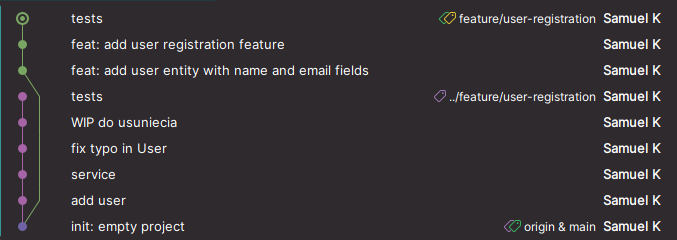

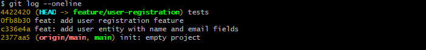

**5. Co robi `drop` — usuwa zmiany z plików czy tylko z historii? Sprawdź zawartość `NOTES.txt` po rebase.**

`drop` usuwa cały commit z historii — czyli wiadomość i zmiany w plikach.

---

## Zadanie 6 — Reflog: odzyskanie po `reset --hard`

**1. Jak długo żyją wpisy reflog? (Wskazówka: zobacz `git config gc.reflogExpire`.)**

Domyślnie żyją 90 dni dla osiągalnych commitów, a dla nieosiągalnych 30. Ale konfigurację można zmienić.

**2. Czy reflog idzie na remote po `git push`? Sprawdź: zaloguj się na GitHubie i sprawdź, czy widzisz tam reflog.**

Nie, reflog jest tylko lokalny — znajduje się na moim dysku, ponieważ każdy programista ma swój reflog.

**3. Jak rozpoznać w `git reflog`, który `HEAD@{N}` to "przed pomyłkowym resetem"?**

Znajdź HEAD z pomyłką i po prostu przywróć do `HEAD@{N+1}`. Czyli o jeden wcześniej.

**4. Czy reflog uratuje Cię, gdy:**

- **(a) przypadkowo `rm -rf` na całym katalogu repo?** — nie
- **(b) przypadkowo `git reset --hard` ale jeszcze przed pushem?** — tak
- **(c) usunąłeś gałąź lokalnie, ale była tylko lokalnie?** — tak

**5. Załącz screenshot `git reflog` po reset i po recovery.**

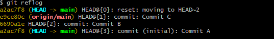

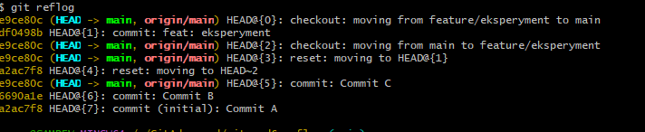

---

## Zadanie 7 — Bisect: binarne polowanie na buga

**1. Ile kroków potrzebował bisect, żeby znaleźć buga? Jak ta liczba ma się do `log₂(8) = 3`?**

3 kroki potrzebował, ponieważ bisect używa binary search.

**2. Hash i wiadomość złego commita — skopiuj z konsoli.**

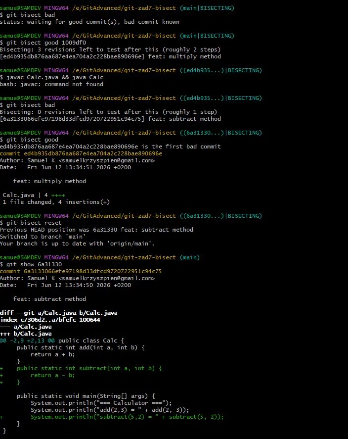

**3. Kiedy bisect jest lepszy niż `git log` + `git diff`?**

`git log` + `git diff` to sprawdzanie ręczne każdego commita po kolei. `git bisect` automatycznie zawęża zakres przez binary search. Bisect lepszy gdy dużo commitów, a bug jest dziwny i niejasny. `log + diff` lepszy gdy wiemy w którym pliku/funkcji jest bug.

**4. Co robi `git bisect run <skrypt>`? Jakie kody wyjścia ma rozumieć skrypt?**

Automatyzuje cały proces sprawdzania — Git sam wykonuje binary search bez pytania o good/bad. Tylko że skrypt musi mieć kody wyjścia: np. `0` — good, `1-124` — bad, `125` — skip, `126-127` — błąd, `128` — błąd krytyczny.

**5. Co zrobić, jeśli któryś commit się *nie kompiluje* podczas bisect i nie da się ocenić? (Wskazówka: `git bisect skip` + exit 125 w `bisect run`.)**

Jeżeli się go nie da ocenić, to się robi `skip` — czyli pomiń commit.

---

## Zadanie 8 — Reset (3 tryby) vs Revert

**1. Wypełnij tabelę:**

| Tryb | `git status` po reset | Zawartość pliku w working dir | Czy zmiany w staging? |
|------|------------------------|-------------------------------|------------------------|
| `--soft` | changes to be committed | dalej wersja C | tak, gotowe do ponownego commit |
| `--mixed` | changes not staged for commit | wersja C | nie — w working dir, ale niestagowane |
| `--hard` | nothing to commit, working tree clean | wersja B | nie — wszystko usunięte |

**2. Dlaczego `git revert` jest bezpieczny dla zespołu, a `git reset --hard` na pushowanym branchu *nie*?**

`git revert` tworzy nowy commit, który cofa zmiany. Historia commitów rośnie do przodu, nic się nie stanie jak ktoś zrobi pull — zero konfliktów.

`git reset --hard` usuwa commity z historii i przez to zwykły push zostanie odrzucony (non-fast-forward), więc trzeba zrobić force push. Czyli jak ktoś coś wrzucił, to zostanie nadpisane.

**3. Po `git reset --hard` — czy stracone commity są usunięte z dysku? Jak je odzyskać?**

Nie są usunięte od razu. Przez 30-90 dni można je odzyskać reflogiem, używając hasha i `git reset --hard <hash>`.

**4. Kiedy chcesz zrobić `--soft` zamiast `--mixed`?**

**soft** — kiedy chcemy przerobić ostatni commit, ale zachować zmiany w staging gotowe do ponownego commita. Np. zapomniałem dodać zdjęcia do 5 zadania. Można zrobić soft reset, dodać plik i `commit -m` nowy z dodanym obrazkiem.

**mixed** — kiedy chcę cofnąć commit i usunąć z staging. Czyli muszę wybrać pliki do stagingu na nowy.

**5. Załącz screenshot `git log --oneline` po `git revert HEAD` — czy oryginalny `Commit C` jest jeszcze w historii?**

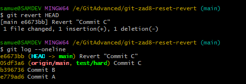

---

## Zadanie 9 — Feature branch + PR z konfliktem (GitHub flow)

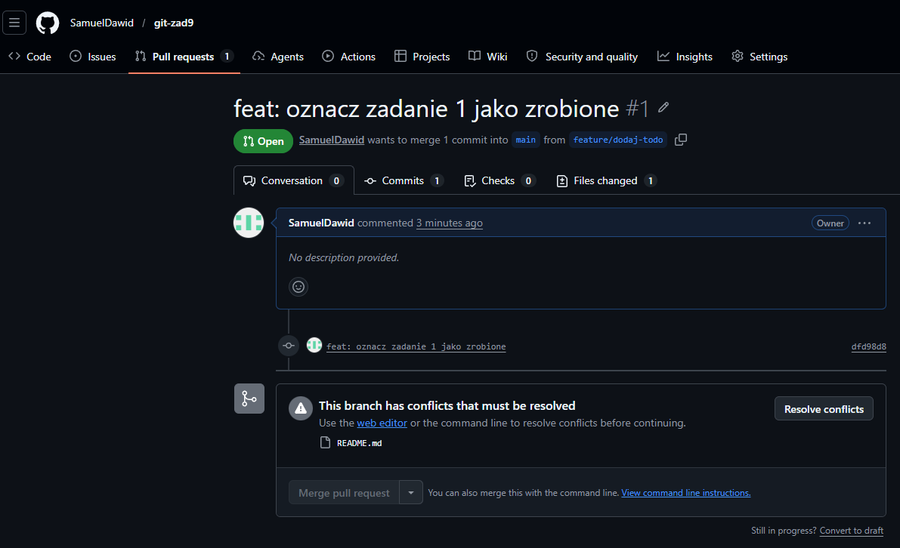

**1. Po co w ogóle pracować na osobnej gałęzi `feature/...` zamiast commitować bezpośrednio na `main`?**

Ponieważ dzięki temu możemy otwierać PR i wymuszać review zanim kod trafi do main. W main trzymamy tylko działający kod, który ma skończone feature'y. Przy pracy w zespole każdy jest odpowiedzialny za swój branch i może sobie nim zarządzać/modyfikować/cofać kiedy chce.

**2. Kiedy używasz `git fetch origin` + `git merge origin/main`, a kiedy `git fetch origin` + `git rebase origin/main`? Jak to wpływa na historię?**

`merge origin/main` — zachowuje pełną historię, widać jak zwija się branch i jest bezpieczny w używaniu, ponieważ istniejące commity nie są przepisywane.

`rebase origin/main` — ma liniową historię i brak merge commita, jednak przepisuje commity i wymaga `push --force`.

**3. Jaka jest różnica między *Squash and merge*, *Create a merge commit* i *Rebase and merge* w UI GitHuba?**

- **Squash and merge** — edytujesz wszystkie commity w jeden i wybierasz jak ma się nazywać. Powstaje jeden commit, który potem jest mergowany z main.
- **Create a merge commit** — robi nowy merge, który pokazuje wszystkie commity z brancha + dodatkowy merge commit.
- **Rebase and merge** — przenosi commity na koniec brancha i przepisuje ich hashe.

**4. Dlaczego po lokalnym `git rebase origin/main` musisz pushować `--force-with-lease` (zamiast zwykłego `--force`)?**

Ponieważ samo `--force` nadpisuje main niezależnie od tego co się tam znajduje, a `--force-with-lease` sprawdza czy origin jest w tym samym stanie, który dostałem od ostatniego fetch.

**5. Wymień 3 dobre praktyki przy zgłaszaniu PR (commit messages, opis, rozmiar PR, code review).**

**Commit messages — konwencja** (każdy commit opisuje jedną logiczną zmianę):
- `feat: add user...`
- `fix: handle null email...`
- `refactor: extract auth service...`

**Opis PR — co i dlaczego:**
- Co robi ten PR
- Dlaczego ta zmiana jest potrzebna
- Jak testować

**Rozmiar PR — mały:**
- Około 400 linii kodu
- Jedna duża logiczna zmiana, nie 5 niezwiązanych ze sobą feature'ów

**Code review — odpowiedz na komentarze:**
- Każdy komentarz wymaga reakcji
- PR mergujesz dopiero po approve
- Reviewer — jego zadaniem jest złapać błędy zanim trafią na produkcję

---

## Zadanie 10 — Śledztwo: kombinacja technik (samodzielne)

### Problem (a) — "stracone" commity

**Jakie narzędzie użyłeś?**

Cherry-pick, ponieważ przenosi konkretne commity z dowolnego miejsca na obecny branch. Jednak kolejność w której przeniesiemy ma znaczenie.

**Co dokładnie zaobserwowałeś (jaki output)?**

Hashe commitów które dodałem są inne niż te, co wpisałem w cherry-picking.

**Jak rozwiązałeś (pełna komenda CLI lub opis kliknięć w IntelliJ)?**

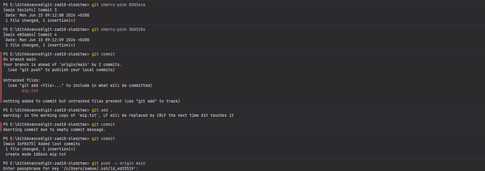

### Problem (b) — bug w jednym z 8 commitów

**Jakie narzędzie użyłeś?**

`git bisect`

**Ile kroków potrzebowałeś?**

Około 3 kroków

**Hash złego commita.**

`2e8f0fbf9ac1021bf59e4547c4aded46166c4ba0` — `feat: dodaj absoluteValue (commit B5)`

**Jak rozwiązałeś?**

Bisect zidentyfikował commit B5 (hash `2e8f0fb`) jako pierwszy zły. Następnie `git show 2e8f0fb` pokazał diff — w commicie poza nową metodą `absoluteValue()` niepostrzeżenie zmieniono `"PI=3.14"` → `"Pi=3.14"` w metodzie `constant()`.

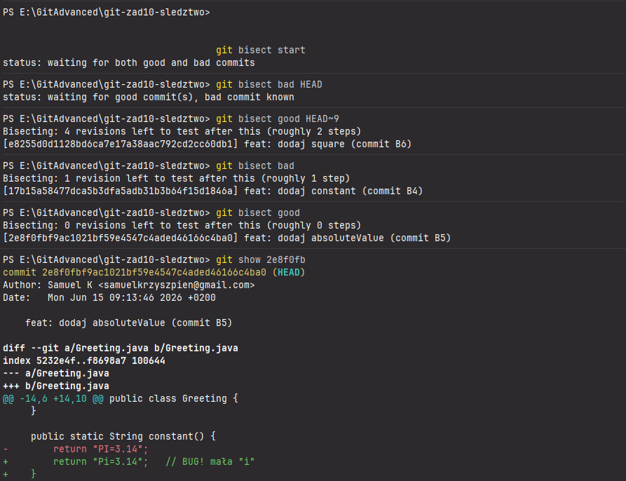

### Problem (c) — niedokończone zmiany + merge gałęzi kolegi

**Jakie narzędzie użyłeś?**

`git commit` + `merge`, ale można też zrobić `git stash`.

**Co stało się z `wip.txt` po Twoich akcjach?**

Został dodany do folderu i zrobiony push na main. Lub przy stash plik nie doda się do historii commit — wtedy zrobienie `git stash` + `merge` + `stash pop`, żeby przywrócić stash.

**Jak wyglądała kolejność komend?**

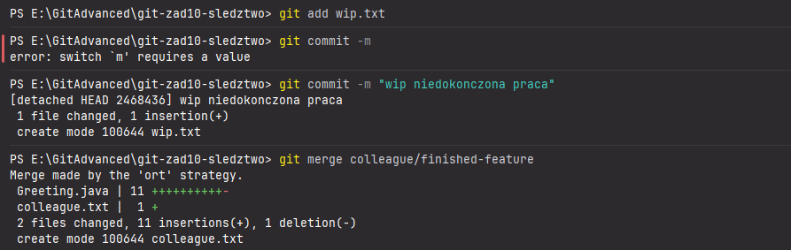

---

## Zadanie 11 — Git Blame: kto zmienił tę linię

**1. Która komenda pokaże autorów tylko linii 4-7 pliku `UserService.java`?**

`git blame -L 4,7 UserService.java`

**2. Załóż, że ostatni commit zmienił tylko biały znak (tab → spacja) w danej linii. Czy `git blame` przypisze tę linię do tego commita? A `git blame -w`?**

`git blame` domyślnie przypisuje zmianę autorowi, nawet jeśli zmienił tylko biały znak. `git blame -w` ignoruje zmiany dotyczące tylko białych znaków — pokazuje autora prawdziwej zmiany.

**3. Czym różni się odpowiedź `git blame` od odpowiedzi `git bisect` na pytanie *"kto wprowadził buga"*?**

`git blame` działa na liniach kodu, pokazując kto ją zmienił. `git bisect` działa po commitach — pokazuje który commit jest wadliwy.

**4. W IntelliJ — jak włączyć widok *Annotate with Git Blame* i jak go wyłączyć?**

Po lewej stronie obok numerów linii → prawy przycisk myszki i tam wybieramy *Annotate with Git Blame*. Ten sam proces do wyłączenia.

**5. Czy `git blame` modyfikuje historię lub repo? Jakie ma efekty uboczne?**

`git blame` to operacja read-only, więc nie modyfikuje ani historii, ani repo. Nie ma żadnych efektów ubocznych.

---

## Zadanie 12 — Git Diff zaawansowane

**1. Wykonałeś `git add file.txt`, ale nie zrobiłeś commita. Jakie polecenie pokaże Ci dokładnie zawartość, która pójdzie w następny commit?**

`git diff --staged`

**2. Czym różni się `git diff main..feature` od `git diff main...feature` (dwie kropki vs trzy)? Kiedy używać której formy?**

**Dwie kropki** pokazują różnice pomiędzy końcowymi stanami obu gałęzi — czyli co jest na feature ale nie ma na main + co jest na main ale nie na feature.

**Trzy kropki** pokazują tylko co zmieniło się na feature od momentu odłączenia od main — czyli diff od wspólnego przodka do końca feature.

**3. Jak wyświetlić statystyki (`+`/`-` per plik) bez pełnej zawartości diffa?**

`git diff --stat ...`

**4. Jakim poleceniem porównasz tylko jeden plik (`app.py`) między dwiema gałęziami?**

`git diff main feature -- app.py`

**5. Jak wyświetlić diff ostatniego commita (zmiany wprowadzone przez `HEAD`)?**

`git show`

---

## Zadanie 13 — Force push z `--force-with-lease`

**1. Czym dokładnie różni się `--force` od `--force-with-lease`? Który chroni przed nadpisaniem cudzej pracy?**

`--force` nadpisuje origin niezależnie od jego stanu — nadpisuje zmiany które ktoś pushnął w międzyczasie.

`--force-with-lease` sprawdza czy origin jest w takim samym stanie jak ostatni fetch, i odrzuca jeżeli coś zostało dodane.

**2. Po jakich operacjach (wymień min. 3) jesteś *zmuszony* użyć force pusha, a kiedy wystarczy zwykły `push`?**

- `rebase` — przepisuje hashe
- `commit --amend` — zmienia hash ostatniego commita
- `git reset` — usuwa commity z historii

**3. Czy `--force-with-lease` zadziała, jeżeli przed pushem zrobiłeś `git fetch origin`, ale nie zauważyłeś nowych commitów? Dlaczego?**

Ponieważ `force-with-lease` działa tak, że sprawdza czy nasz origin ma jakieś zmiany których my nie mamy. Jak zrobimy `fetch origin` i nie zauważymy tych zmian, to niestety dla force pusha to jest znak, że origin się nie zmienił, więc robi push.

**4. Jak w IntelliJ uruchomić *Force Push*? Czy używa `--force` czy `--force-with-lease`?**

W panelu Git jest opcja Push. Jeżeli się nie powiedzie push, to trzeba kliknąć strzałkę obok przycisku Push → *Force Push*. IntelliJ używa `--force-with-lease` pod spodem, więc nie ma opcji w UI.

**5. Wymień 2 gałęzie, na których w pracy zespołowej *nigdy* nie powinno się robić force pusha (i powiedz, jak je chronić w UI GitHuba).**

Na gałęzi `main`/`develop` albo `release`. Możemy chronić poprzez *Settings → Branches → Branch protection rules → Add rule*.

---

## Zadanie 14 — Git Alias: skróty dla codziennych komend

**1. Jaka jest różnica między `--global` a `--local` przy definiowaniu aliasu? Gdzie zapisywany jest każdy z nich?**

`global` jest dla użytkownika — zapis na dysku w katalogu domowym. `local` tylko dla jednego repo — zapis w repo.

**2. Co oznacza prefiks `!` w aliasie (np. `alias.up = !git fetch ...`)? Czego on *nie pozwala* zrobić bez tego prefiksu?**

Prefiks `!` pozwala uruchomić dowolne komendy shell. Bez niego można tylko wywołać subkomendy.

**3. Jak wyświetlić listę wszystkich zdefiniowanych aliasów?**

`git config --get-regexp '^alias\.'` lub `git config --list | grep alias`

**4. Czy alias `git ci` zostanie automatycznie przesłany do współpracowników, gdy zrobisz `git push`? Dlaczego?**

Nie, ponieważ aliasy są tylko lokalne na mojej maszynie.

**5. Zaproponuj 3 aliasy, które dla Ciebie osobiście miałyby największy sens w codziennej pracy. Uzasadnij wybór.**

- `git lg` — zamiast `git log --oneline --graph --all --decorate`. Bardzo często sprawdza się log, a to dość długa komenda.
- `git ci -m "init"` — zamiast `git commit -m`. Codziennie dodajemy kilkanaście albo kilkadziesiąt commitów.
- `git config --global alias.hist "log --pretty=format:'%h %ad | %s%d [%an]' --graph --date=short"` — bo można ładnie sprawdzić kto co napisał.
